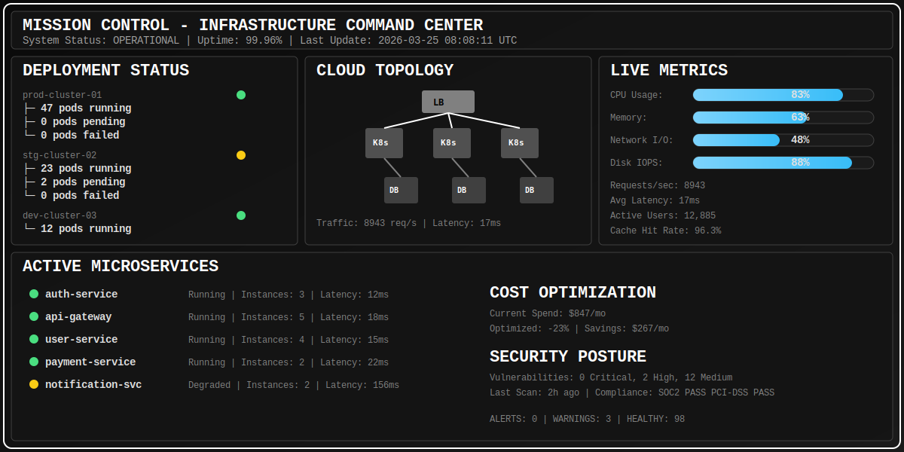
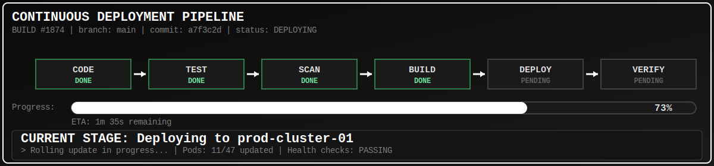
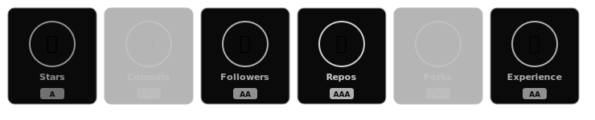
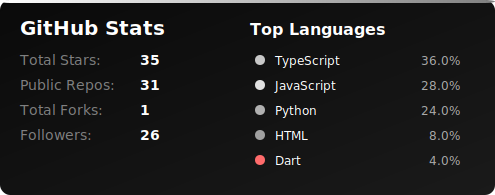
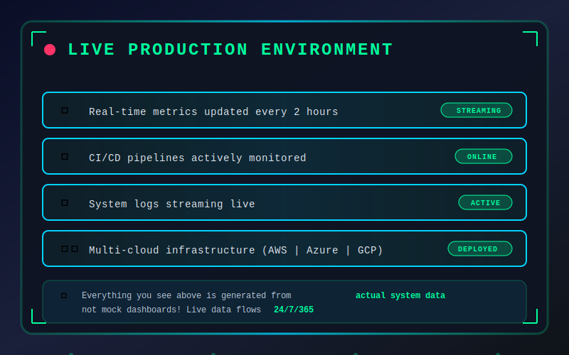

<div align="center">
  
</div>

<div align="center">
  
</div>

<div align="center">
  
</div>

<br/>

## 🌐 Let's Connect & Collaborate:

<div align="center">
  
[](https://www.linkedin.com/in/meghvyas3132)
[](https://meghvyas.netlify.app)
[](https://instagram.com/megh.3132)
[](mailto:megh.vyas@yahoo.com)

</div>

<br/>


<details open>
<summary><h2>🚀 About Me</h2></summary>
<br>

```yaml
name: Megh Vyas
located_in: Building scalable systems in the cloud
current_focus:
  - DevOps Excellence
  - Site Reliability Engineering
  - Cloud Native Architectures
  - Full Stack Development (Backend Heavy)
  
education: ["Computer Science", "Cloud Computing", "System Design"]

fields_of_interests:
  - Cloud Infrastructure & Architecture
  - CI/CD Automation
  - Microservices & Containerization  
  - Backend Engineering
  - System Design & Scalability
  
technical_background:
  - DevOps Engineering
  - Site Reliability Engineering (SRE)
  - Solution/Cloud Architecture
  - System Architecture
  - Full Stack Development
  
currently_learning: ["Kubernetes Advanced Patterns", "Terraform Enterprise", "Go", "System Design"]
2026_goals: ["Master Kubernetes", "AWS Certified Solutions Architect", "Contribute to OSS"]
hobbies: ["Coding", "Cloud Labs", "Tech Blogs", "Automation"]
```

</details>


## ⚡ INFRASTRUCTURE COMMAND CENTER

<div align="center">
  
</div>


## 🚀 CI/CD PIPELINE STATUS

<div align="center">
  
</div>


## 📟 LIVE SYSTEM LOGS

<div align="center">
  
</div>


## 💻 Tech Arsenal:

<details open>
<summary><h3>☁️ Cloud & Infrastructure</h3></summary>
<br>


</details>

<details open>
<summary><h3>🐳 DevOps & CI/CD</h3></summary>
<br>


</details>

<details open>
<summary><h3>💾 Databases & Caching</h3></summary>
<br>


</details>

<details open>
<summary><h3>⚙️ Languages & Frameworks</h3></summary>
<br>


</details>

<details open>
<summary><h3>🛠️ Tools & Others</h3></summary>
<br>


</details>


## 🏆 GitHub Trophies

<div align="center">
  
</div>


## 📊 GitHub Analytics:

<div align="center">
  
  
</div>

<div align="center">
  
</div>


## � Profile Stats:

<div align="center">
  


</div>

<br/>

<div align="center">
  
</div>

---

<div align="center">
  
</div>
<br/>

<div align="center">
  <i>⚡ "Code is like humor. When you have to explain it, it's bad." – Cory House</i>
</div>

<!-- Proudly created with GPRM ( https://gprm.itsvg.in ) -->
