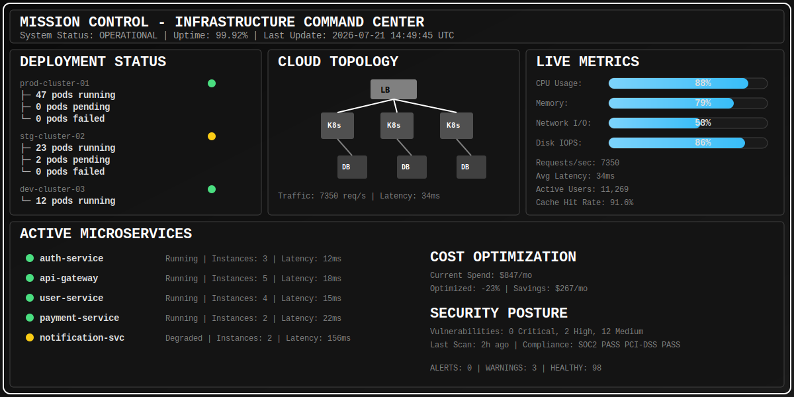
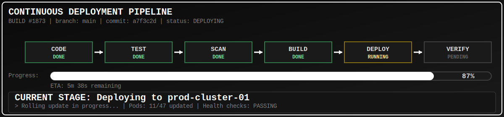
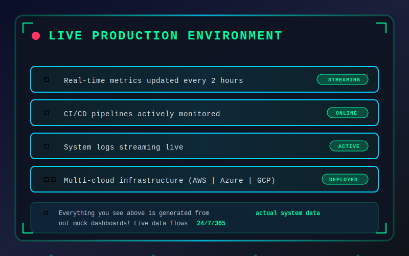

<div align="center">
  
</div>

<br/>

<div align="center">
  
</div>

<br/>
<br/>

<div align="center">

[](https://www.linkedin.com/in/meghvyas3132)&nbsp;&nbsp;[](https://meghvyas.netlify.app)&nbsp;&nbsp;[](https://instagram.com/megh.3132)&nbsp;&nbsp;[](mailto:megh.vyas@yahoo.com)

</div>

<br/>


<details open>
<summary><h2>&nbsp;〔 Building 〕</h2></summary>

<br/>

```
 ╭──────────────────────────────────────────────────────────────────────╮
 │  aexiz.com: ~$                                                       │
 ╰──────────────────────────────────────────────────────────────────────╯
```

<div align="center">
  
</div>

```
 ╔════════════════════════════════════════════════════════════════════╗
 ║   >  megh.vyas@aexiz.com  —  Co-Founder  //  AEXIZ SOLUTIONS  ■      ║
 ╚════════════════════════════════════════════════════════════════════╝
```

</details>


## &nbsp;〔 Infrastructure Command Center 〕

<div align="center">
  
</div>


## &nbsp;〔 CI/CD Pipeline Status 〕

<div align="center">
  
</div>


## &nbsp;〔 Live System Logs 〕

<div align="center">
  
</div>


## &nbsp;〔 Tech Arsenal 〕

<details open>
<summary><h3>&nbsp;&nbsp;&nbsp; Programming &amp; Scripting</h3></summary>
<br/>
<div align="center">

&nbsp;&nbsp;&nbsp;&nbsp;

</div>
</details>

<details open>
<summary><h3>&nbsp;&nbsp;&nbsp; AI / ML &amp; LLM</h3></summary>
<br/>
<div align="center">

&nbsp;&nbsp;&nbsp;&nbsp;&nbsp;&nbsp;

<br/>

&nbsp;&nbsp;&nbsp;&nbsp;&nbsp;

</div>
</details>

<details open>
<summary><h3>&nbsp;&nbsp;&nbsp; RAG &amp; Vector Databases</h3></summary>
<br/>
<div align="center">

&nbsp;&nbsp;&nbsp;&nbsp;&nbsp;&nbsp;

</div>
</details>

<details open>
<summary><h3>&nbsp;&nbsp;&nbsp; Backend &amp; APIs</h3></summary>
<br/>
<div align="center">

&nbsp;&nbsp;&nbsp;&nbsp;&nbsp;&nbsp;

<br/>

&nbsp;&nbsp;&nbsp;&nbsp;

</div>
</details>

<details open>
<summary><h3>&nbsp;&nbsp;&nbsp; Databases</h3></summary>
<br/>
<div align="center">

&nbsp;&nbsp;&nbsp;&nbsp;&nbsp;

</div>
</details>

<details open>
<summary><h3>&nbsp;&nbsp;&nbsp; Cloud &amp; Infrastructure</h3></summary>
<br/>
<div align="center">

&nbsp;&nbsp;&nbsp;&nbsp;

<br/>

<sub><i>AWS: EC2 · S3 · RDS · Aurora · Lambda · IAM · SageMaker</i></sub>

</div>
</details>

<details open>
<summary><h3>&nbsp;&nbsp;&nbsp; DevOps &amp; CI/CD</h3></summary>
<br/>
<div align="center">

&nbsp;&nbsp;&nbsp;&nbsp;&nbsp;&nbsp;

<br/>

&nbsp;&nbsp;&nbsp;&nbsp;

<br/>

<sub><i>Kubernetes: K8s · K3s</i></sub>

</div>
</details>

<details open>
<summary><h3>&nbsp;&nbsp;&nbsp; Observability</h3></summary>
<br/>
<div align="center">

&nbsp;&nbsp;&nbsp;&nbsp;&nbsp;&nbsp;&nbsp;

</div>
</details>

<details open>
<summary><h3>&nbsp;&nbsp;&nbsp; Security &amp; Auth</h3></summary>
<br/>
<div align="center">

&nbsp;&nbsp;&nbsp;

</div>
</details>

<details open>
<summary><h3>&nbsp;&nbsp;&nbsp; Tools &amp; Collaboration</h3></summary>
<br/>
<div align="center">

&nbsp;&nbsp;&nbsp;&nbsp;&nbsp;

</div>
</details>


## &nbsp;〔 GitHub Analytics 〕

<br/>

<div align="center">
  
</div>

<br/>

<div align="center">
  
</div>


## &nbsp;〔 Profile Stats 〕

<br/>

<div align="center">

&nbsp;&nbsp;&nbsp;&nbsp;

</div>
<br><br>
---

<div align="center">
  
</div>

<br/>

<div align="center">

> *"Code is like humor. When you have to explain it, it's bad."* &nbsp;— Cory House

</div>
