<!--
  Megh Vyas — GitHub profile.
  A Risograph print poster, built to match the portfolio at https://megh.tech.
  Every panel is a self-contained SVG (fonts baked to vector paths), so it
  renders identically everywhere — no external services, no animation.
  stats.svg / streak.svg are the only live pieces (refreshed by the Actions cron).
-->

<a href="https://megh.tech">
  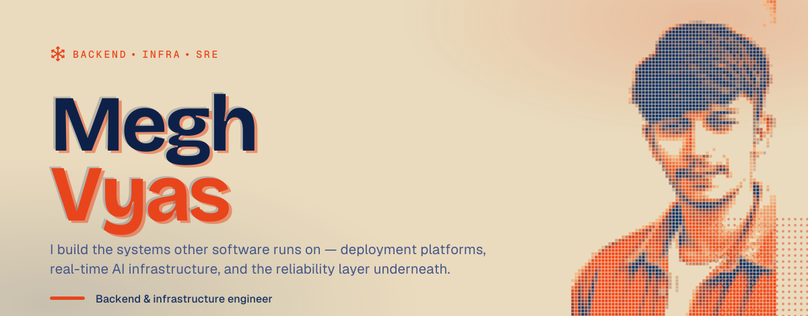
</a>

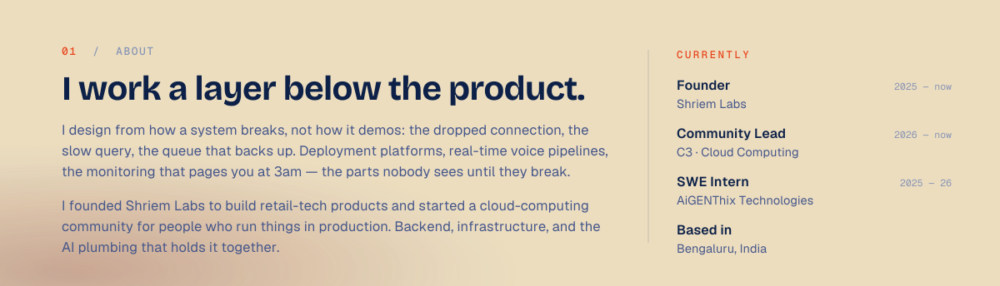

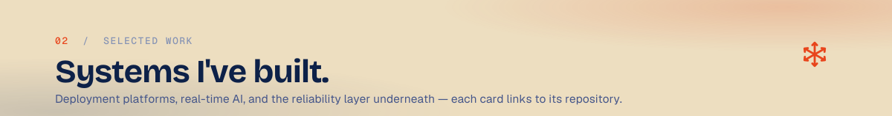

  <a href="https://github.com/MeghVyas3132/Zyphron-OSS">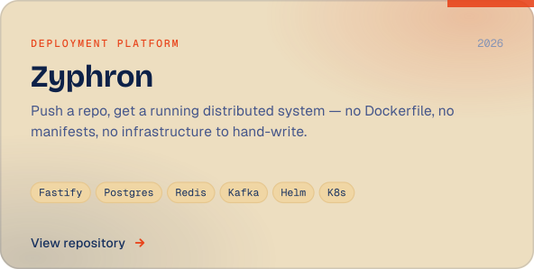</a>
  <a href="https://github.com/MeghVyas3132">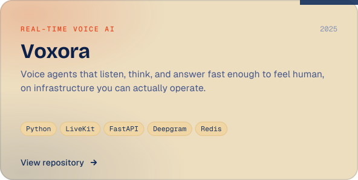</a>

  <a href="https://github.com/MeghVyas3132/zta-deployed">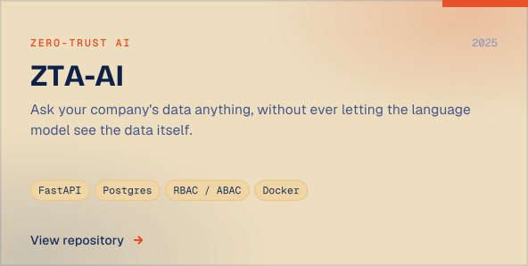</a>
  <a href="https://github.com/MeghVyas3132/Multi-Modal-RAG-engine">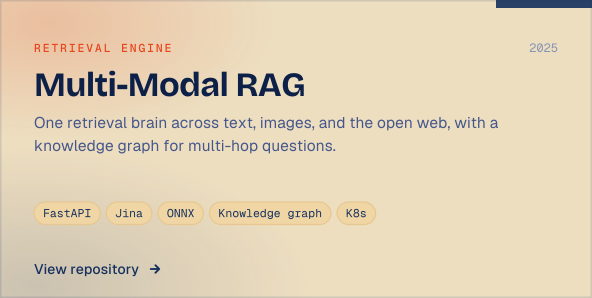</a>

  <a href="https://github.com/MeghVyas3132/REX2.0">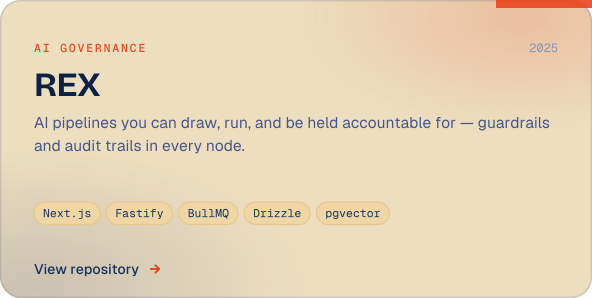</a>
  <a href="https://github.com/MeghVyas3132/Metrics-Health-Tracker">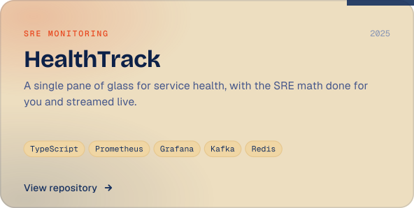</a>

<a href="https://github.com/MeghVyas3132?tab=repositories">
  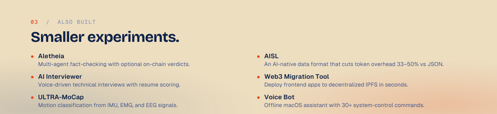
</a>

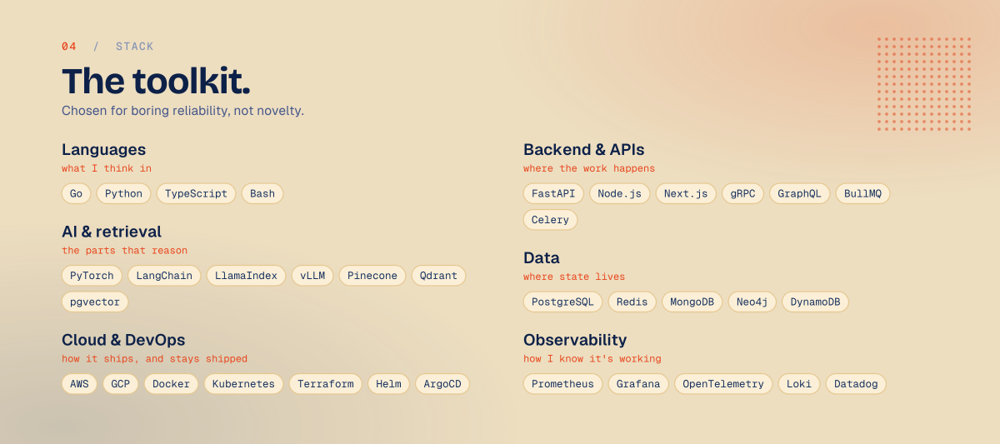

  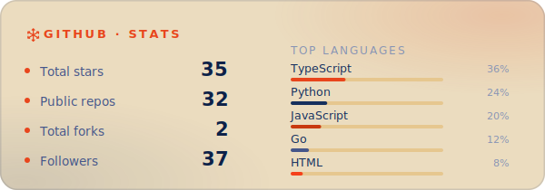
  

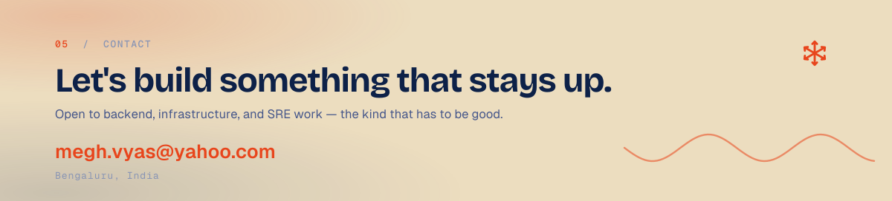

  <a href="https://github.com/MeghVyas3132">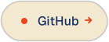</a>&nbsp;
  <a href="https://www.linkedin.com/in/meghvyas3132">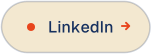</a>&nbsp;
  <a href="https://instagram.com/megh.3132">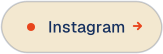</a>&nbsp;
  

